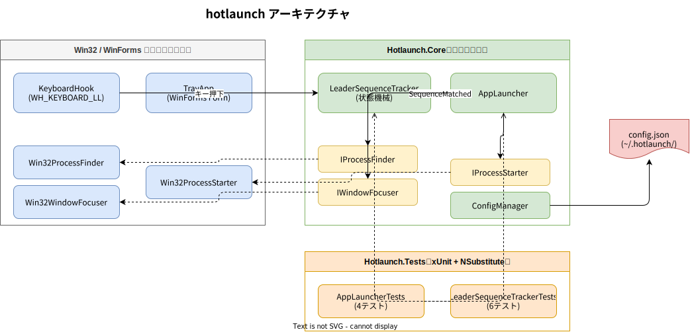

# 仕様書

## 概要

hotlaunch は Windows 常駐型のグローバルホットキーランチャーです。
**リーダーキーシーケンス**方式を採用しており、リーダーキーを押してから一定時間内に別のキーを押すとアプリが起動します。

---

## 機能一覧

| 機能 | 状態 |
|------|------|
| システムトレイに常駐 | ✅ 実装済み |
| リーダーキーシーケンスでアプリ起動 | ✅ 実装済み |
| 起動済みアプリのウィンドウをフォアグラウンドへ | ✅ 実装済み |
| 最小化ウィンドウの復元 | ✅ 実装済み |
| JSON 設定ファイル読み込み | ✅ 実装済み |
| デフォルト設定の自動生成 | ✅ 実装済み |
| ファイルへのログ出力 | ✅ 実装済み |
| `--verbose` によるログ詳細化 | ✅ 実装済み |
| `--tail` によるリアルタイムログウィンドウ | ✅ 実装済み |
| トレイアイコン右クリックメニュー（終了） | ✅ 実装済み |
| トレイメニューからリマッパー状態リセット | ✅ 実装済み |
| リーダーキー連打（N回押し）対応 | ✅ 実装済み |
| リーダーキー待機中のトレイアイコン色変更 | ✅ 実装済み |
| GUI での設定編集画面 | 🔲 未実装（将来候補） |
| Windows スタートアップ自動起動 | 🔲 未実装（将来候補） |

---

## リーダーキーシーケンスの動作

```
キー入力なし
    │
    ▼
[Idle 状態]
    │  リーダーキー押下（例: F12）
    ▼
[WaitingForSequence 状態] ──── timeoutMs 経過 ──→ [Idle 状態]
    │                                              （タイムアウト）
    │  Modifier キー（Shift/Ctrl/Alt/Win）
    │  → 無視して待機継続
    │
    │  登録済みキー押下（例: W）
    ├──→ アプリ起動 / フォーカス → [Idle 状態]
    │
    │  未登録キー押下
    └──→ 何もしない → [Idle 状態]
```

### Modifier キーを無視する理由

日本語 Windows では `W` を入力するとき `Shift+W` のように Shift が先に押されることがあります。
Modifier キー（Shift/Ctrl/Alt/Win）を受け取っても待機状態を維持することで、シーケンスが誤ってキャンセルされないようにしています。

---

## 設定ファイル仕様

### パス

```
%USERPROFILE%\.hotlaunch\config.json
```

初回起動時にファイルが存在しない場合、デフォルト設定で自動生成されます。

### スキーマ

```json
{
  "leader": {
    "key": "F12",
    "timeoutMs": 2000
  },
  "hotkeys": [
    {
      "key": "W",
      "appPath": "C:\\Program Files\\WezTerm\\wezterm-gui.exe",
      "args": "",
      "processName": "wezterm-gui"
    }
  ]
}
```

### フィールド説明

#### `leader`

| フィールド | 型 | デフォルト | 説明 |
|-----------|-----|-----------|------|
| `key` | string | `"F12"` | リーダーキー名（`Keys` 列挙体の名前。`"Alt"` / `"Henkan"` なども使用可） |
| `timeoutMs` | int | `2000` | シーケンス入力の待機時間（ミリ秒） |
| `count` | int | `1` | リーダーキーを何回連打でシーケンス待機に入るか（例: `2` で二度押し） |

#### `hotkeys[]`

| フィールド | 型 | 必須 | 説明 |
|-----------|-----|------|------|
| `key` | string | ✅ | シーケンスキー名（例: `"W"`, `"T"`, `"F1"` など） |
| `appPath` | string | ✅ | 起動する実行ファイルのフルパス |
| `args` | string | - | 起動引数（省略時は空文字） |
| `processName` | string | - | フォーカス判定に使うプロセス名。省略時は `appPath` のファイル名（拡張子なし）を使用 |

### 設定例（複数アプリ登録）

```json
{
  "leader": { "key": "F12", "timeoutMs": 2000 },
  "hotkeys": [
    {
      "key": "W",
      "appPath": "C:\\Program Files\\WezTerm\\wezterm-gui.exe",
      "processName": "wezterm-gui"
    },
    {
      "key": "C",
      "appPath": "C:\\Users\\you\\AppData\\Local\\Programs\\cursor\\Cursor.exe",
      "processName": "cursor"
    },
    {
      "key": "B",
      "appPath": "C:\\Program Files\\Mozilla Firefox\\firefox.exe",
      "processName": "firefox"
    }
  ]
}
```

---

## アーキテクチャ



### レイヤー構成

| レイヤー | プロジェクト | 説明 |
|---------|-------------|------|
| ビジネスロジック | `Hotlaunch.Core` | Win32 非依存。WSL/Linux でもテスト可能 |
| Win32 実装 | `Hotlaunch` | P/Invoke による Win32 API 呼び出し |
| テスト | `Hotlaunch.Tests` | xUnit + NSubstitute によるユニットテスト |

### コンポーネント

```
KeyboardHook（WH_KEYBOARD_LL）
    │ キー押下イベント
    ▼
LeaderSequenceTracker
    │ シーケンスマッチ時
    ▼
AppLauncher
    ├── IProcessFinder  → Win32ProcessFinder  （プロセス検索）
    ├── IWindowFocuser  → Win32WindowFocuser  （ウィンドウフォーカス）
    └── IProcessStarter → Win32ProcessStarter （プロセス起動）

ConfigManager → AppConfig（設定読み込み）
TrayApp（WPF + H.NotifyIcon.Wpf）→ 全コンポーネントの組み立て・ライフサイクル管理
```

### テスト戦略

`Hotlaunch.Core` の3インターフェース（`IProcessFinder` / `IWindowFocuser` / `IProcessStarter`）を NSubstitute でモック化することで、Win32 環境なしで `AppLauncher` のロジックをテストできます。

`LeaderSequenceTracker` は純粋なロジックのため、モックなしで直接テストします。

---

## ログ

| 出力先 | パス |
|--------|------|
| ファイル | `%USERPROFILE%\.hotlaunch\hotlaunchYYYYMMDD.log` |

ログは7日分保持され、古いものは自動削除されます。

### 起動オプション

| オプション | 説明 |
|-----------|------|
| （なし） | 通常起動。ログはファイルのみ |
| `--tail` | リアルタイムログウィンドウをポップアップ表示 |
| `--verbose` / `-v` | 全キー押下イベントも出力（Debug レベル） |
| `--tail --verbose` | ログウィンドウ + 全キーログ（調査用） |

### ログレベル

| モード | 出力内容 |
|--------|---------|
| 通常 | 起動/終了、リーダーキー押下、アプリ起動/フォーカス、リマッパー状態変化 |
| 詳細（`--verbose`） | 上記 + 全キー押下イベント |
| 異常検知 | リマッパーにスタックキーが残留している場合 Warning ログ（30秒ごと） |
